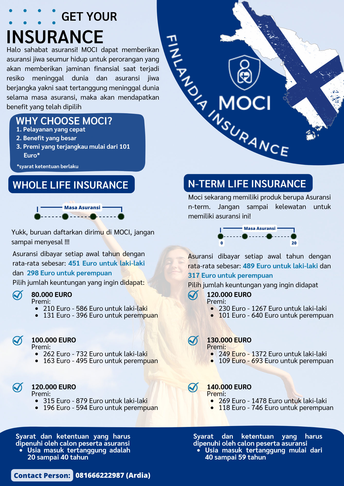

## PORTFOLIO

---

## Actuarial Mathematics 

### Actuarial Present Value 

In this project, me and my team make a poster that include insurance premiums for certain age in Finlandia. In this case, we use whole life insurance and n-term insurance. We use R to calculate actuarial present value that needed.

---
## Data Analytics Learning Path-Zenius

### Default Risk Prediction

This is a final project which contains default risk prediction. We use statistical tools to analysis and machine learning for modelling.

---
## Water Feasibility Prediction-Competition by Gammafest 2023

This is This is my first competition using machine learning to make water feasibility prediction. Unfortunately, my team can't be a winner. But still it can be my capstone experience in machine learning.

